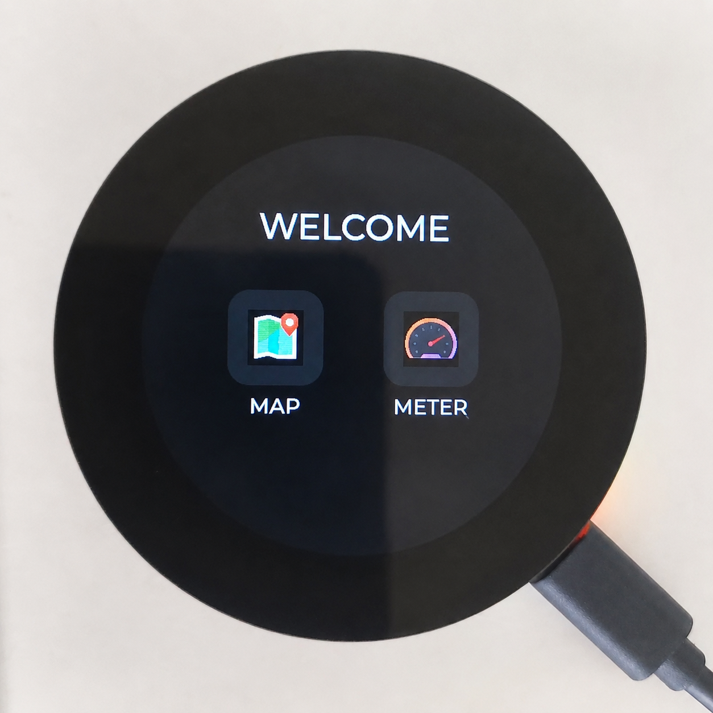
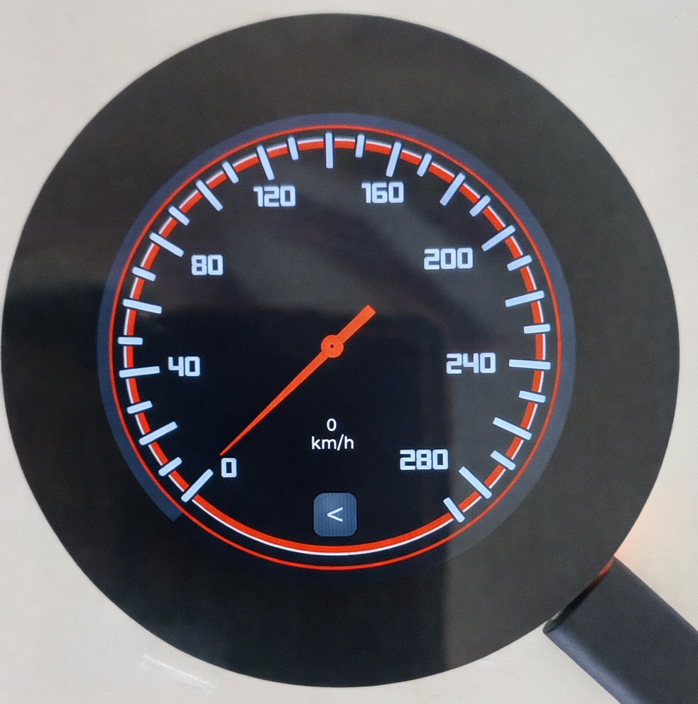
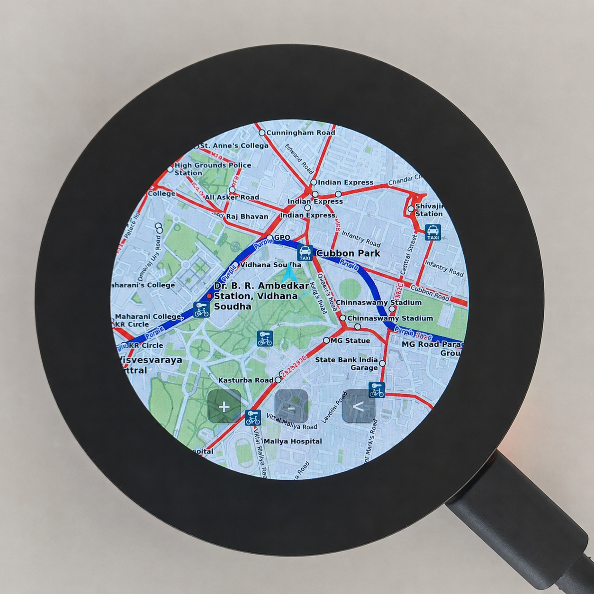
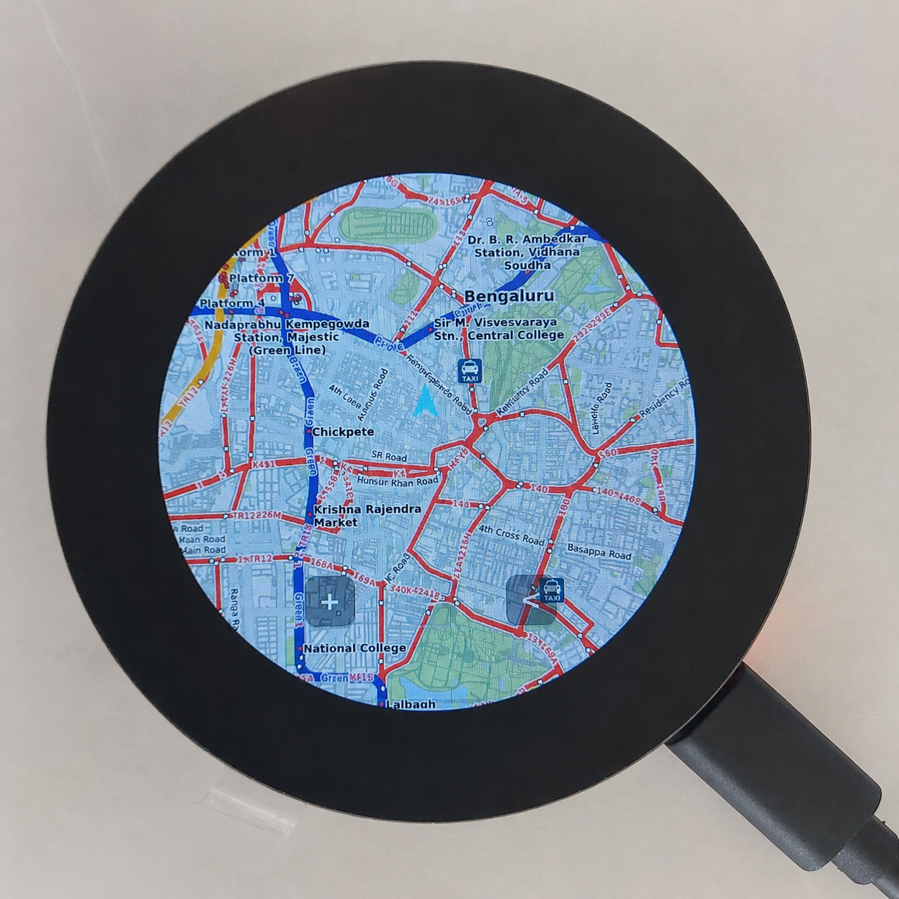
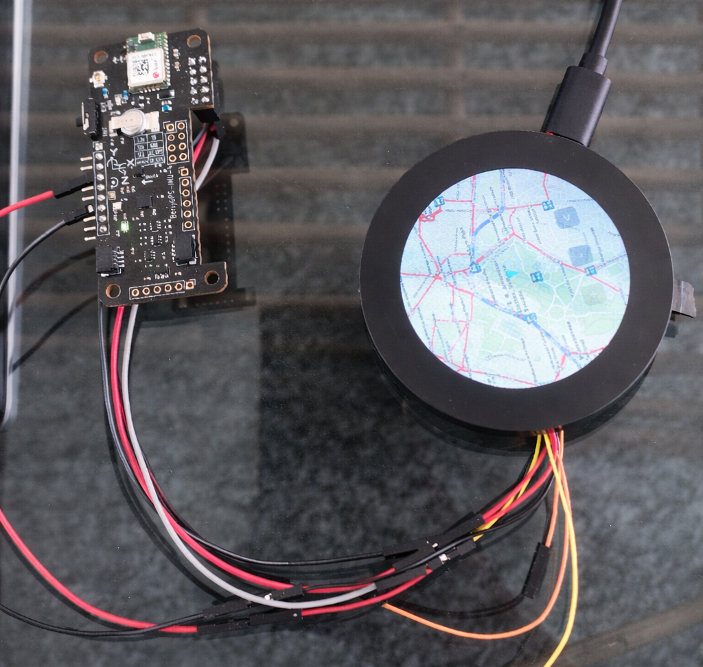

# ESP32-S3 Offline GPS Navigation System

A fully offline embedded navigation system built on ESP32-S3 with real-time GPS tracking, magnetometer heading, and LVGL-rendered OpenStreetMap tiles — zero network dependency.

## Demo

Prototype demonstration of the ESP32-S3 offline navigation system showcasing the touchscreen interface, offline map rendering, and navigation functionality:

https://github.com/user-attachments/assets/ac3ee49c-818b-4f88-b43a-9c3aa9d40c8d

## Overview

Unlike online navigation systems such as Google Maps, this project needs no internet connection during operation — all map data is stored locally on an SD card. It brings together GPS, IMU, SD card storage, an LVGL graphical interface, and touchscreen interaction in a single embedded system that displays live navigation on a round touch display.

The system boots to a welcome screen with two modes:
- **Map** — offline navigation view with a live position/heading arrow over locally stored OpenStreetMap tiles
- **Meter** — GPS-based speedometer built in SquareLine Studio

## Project Images

| Home Screen | GPS Speedometer |
|---|---|
|  |  |

| Navigation View | Offline Map (Zoomed Out) |
|---|---|
|  |  |

| Hardware Setup |
|---|
|  |

## Features

- Real-time GPS location and speed display (TinyGPS++ / NMEA)
- ~1,000 OpenStreetMap tiles across 3 zoom levels, stored on SD card
- Magnetometer-based compass heading, used to rotate the position arrow
- LVGL graphical interface on a 2.1" round touch display
- GPS-derived speedometer built with SquareLine Studio
- Fully offline — no WiFi, no cellular required

## Hardware

| Component | Details |
|---|---|
| Microcontroller | Waveshare ESP32-S3 Touch IPS LCD 2.1" (round, all-in-one board) |
| GPS + IMU | BerryGPS-IMU v4 (GPS, accelerometer, gyroscope, magnetometer) — external, wired over I²C/UART |
| Storage | MicroSD card slot, integrated on the display module (~1,000 offline map tiles) |
| Display | ST7701 round touchscreen LCD, integrated on the display module |

## Connections

The Waveshare ESP32-S3 Touch Display is an all-in-one board — display, touch controller, and SD card slot are integrated on-module, so no separate wiring is needed for those. The only external wiring is to the BerryGPS-IMU v4:

| ESP32-S3 Pin | BerryGPS-IMU V4 Connection | Purpose |
|---|---|---|
| 3.3V | I²C Header – 3.3V | Power supply |
| GND | I²C Header – GND | Common Ground |
| 3.3V | Header Pin 1 (3.3V) | Power supply |
| GND | Header Pin 6 or 9 (GND) | Common Ground |
| RX | Header Pin 10 (GPIO15 / GPS TX) | Receives GPS NMEA data |

- **I²C** — power, ground, and communication with the onboard magnetometer/accelerometer/gyroscope
- **UART (RX)** — receives GPS NMEA sentences from the module's GPS TX line

## How It Works

1. On boot, the ESP32-S3 initializes the display, touchscreen, LVGL engine, SD card, GPS (UART), and IMU (I²C).
2. The welcome screen offers **Map** or **Meter**.
3. **Map mode:** GPS provides latitude/longitude/speed (parsed via TinyGPS++); the magnetometer provides heading. The app loads only the required OpenStreetMap tiles from the SD card for the current position and zoom level, and renders a directional arrow that moves and rotates with the device.
4. **Meter mode:** A SquareLine Studio-designed speedometer UI displays live GPS-derived speed.

This project focuses on offline map visualization and live position/heading display — it does not implement route planning, SLAM, obstacle avoidance, sensor-fusion filters (Kalman/Madgwick), or autonomous navigation.

## Offline Map Preparation

The target area was downloaded from OpenStreetMap, split into smaller tiles (since the ESP32 can't handle large map images efficiently), converted to an embedded-compatible format, and organized by zoom level on the SD card. At runtime, only the tiles needed for the current view are loaded, keeping memory usage low and rendering smooth.

## Tech Stack

`ESP32-S3` `Embedded C++` `LVGL` `TinyGPS++` `OpenStreetMap` `I2C` `UART` `SquareLine Studio` `Arduino Framework`

## Results

- Stable offline navigation with GPS fix across 10+ satellites
- Real-time map tile rendering with directional arrow overlay
- Speed display responsive to GPS HDOP-filtered velocity data

## Built During

Engineering Internship — i-WORKZ Automotive Pvt. Ltd., Bengaluru (Jan–Mar 2026)
